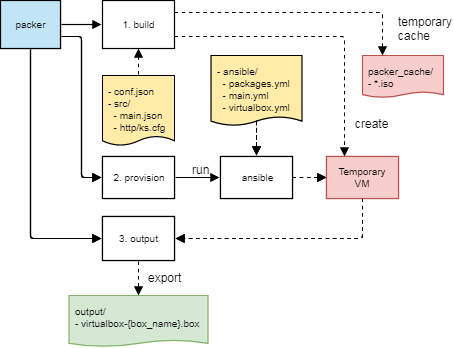

# Packer Virtualbox Vagrant Centos7 7.2-7511

## Description

Creates a Virtualbox .box file suitable for use with Vagrant, with a very specific version of Centos and specific configuration.

- working Virtualbox shared filesystem driver (vboxsf)
- virtual DVD
- vagrant user *not* with uid `1000` (so the first usr *you* create will get `1000`)
- root pw and vagrant pw = "vagrant"
- verbose, non-graphical boot
- unnecessary drivers are removed and various basic tools are added
- en_US.UTF-8 & US keyboard
- firewall disabled
- selinux permissive
- timezone UTC

## Pre-requisites

- [VirtualBox](https://www.virtualbox.org/)
- [Packer](http://www.packer.io/)
- [Vagrant](http://vagrantup.com/)

## Usage

Unfortunately (due to Packer limitations),
user configuration has to live in more than one place.

    vi conf.json                  # check / edit config
    vi ansible/packages.yml       # check / edit (check kernel package versions)

    packer build -force -var-file conf.json src/main.json

## Directory Structure

    .
    ├── conf.json            # <<<── user configuration
    ├── ansible/
    |   ├─ packages.yml      # <<<── MORE user configuration
    |   └─ ...
    ├── README.md
    ├── output/              # final .box file goes in here
    ├── packer_cache/        # downloaded artifacts (e.g. iso's), can be deleted
    └── src/                 # source scripts & data

## Diagram

    Diagram source: https://drive.google.com/file/d/1eySy5xITxpMHR8rxNUjJzDktSZtpd637/view?usp=sharing
